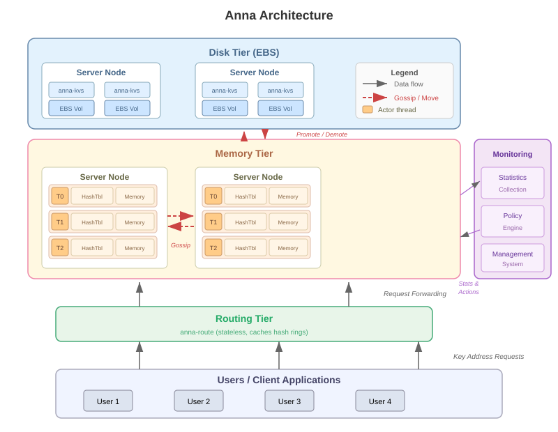

# Anna Architecture

Anna is a partitioned, multi-mastered key-value store that achieves high performance
and elasticity via wait-free execution and coordination-free consistency. It was
developed at UC Berkeley's RISE Lab.

## Design Principles

Anna's design rests on four requirements:

1. **Partitioning** — The key space is sharded not only across nodes but also across
   cores for high performance.
2. **Multi-master replication** — Multiple replicas can concurrently serve puts and
   gets against a single key from multiple threads.
3. **Wait-free execution** — Each thread is always doing useful work, never waiting
   for other threads for coordination or consistency.
4. **Coordination-free consistency** — A unified implementation supports a wide range
   of consistency models without coordination protocols.

## System Components

An Anna deployment consists of three required component types (storage,
monitoring, and cluster management) plus an optional legacy routing tier:

### Client-Side Routing

Clients now build a local hash ring from KVS membership data and compute
key-to-server mappings locally, without requiring a separate routing server.
The flow is:

1. The client reads `ANNA_METADATA|kvs_members` from any KVS node to discover
   cluster membership
2. The client builds a local hash ring using the shared `anna-hashring` library
3. For each request, the client hashes the key and sends it directly to the
   responsible KVS node
4. If a `WRONG_THREAD` error is returned (e.g., during cluster reconfiguration),
   the client refreshes its hash ring and retries

In the Rust client, call `enable_direct_routing()` to activate client-side
routing. All client libraries support this mode.

### Routing Tier (anna-route) — Optional, Deprecated

The `anna-route` process is a legacy routing server kept for backward
compatibility. It is **optional** — clients using client-side routing do not
need it. When used, routing nodes:

- Cache the storage tiers' hash rings and replication vectors
- Return memory-tier addresses when available (for performance)
- Are stateless — only maintain soft state (cached metadata)
- Handle cluster configuration changes transparently to clients

### Storage Tier (anna-kvs)

Storage nodes run the Anna storage kernel. Each node contains multiple worker
threads, each pinned to a CPU core. Each thread:

- Maintains a **private hash table** (no shared memory between threads)
- Runs a tight event loop processing client requests via ZeroMQ
- Periodically **multicasts** updates to replicas via a "gossip" protocol
- Uses **consistent hashing** with virtual nodes for key partitioning

The storage kernel is identical across memory and disk tiers — the only
difference is the serialization layer (memory buffer vs. disk volume).

### Monitoring Node (anna-monitor)

The monitoring system collects statistics and drives the policy engine:

- Tracks per-key access frequency and per-node storage consumption
- Triggers **elasticity** actions (add/remove nodes)
- Triggers **hot-key replication** (replicate popular keys across more cores/nodes)
- Triggers **cross-tier data movement** (promote hot data to memory, demote cold to disk)

### Cluster Management

In a cloud deployment, an external orchestration system handles allocating and
deallocating nodes. The monitor's policy engine emits scaling alerts (protobuf
`ScalingAlert` messages via ZMQ PUSH) that the operator's tooling consumes to
provision or decommission infrastructure.

## Actor Model and Event Loop

Each Anna worker thread implements a **coordination-free actor**:

1. The thread checks for incoming requests (PUT, GET) via ZeroMQ poll
2. It serves the request against its private hash table
3. It appends updated keys to a local **changeset**
4. At the end of each **multicast epoch**, the thread:
   - Multicasts its changeset to other masters responsible for those keys
   - Checks for incoming multicasts from other actors
   - Merges received updates into its local state using lattice merge

This design ensures:
- No thread synchronization (wait-free)
- No shared memory contention
- Updates propagate asynchronously via gossip
- Lattice merge guarantees eventual consistency despite message reordering

## Communication

Anna uses ZeroMQ for all communication:

- **Intra-node** (between threads on same machine): ZeroMQ `inproc` transport
  with shared memory buffers for zero-copy messaging
- **Inter-node** (between machines): ZeroMQ `tcp` transport with Protocol
  Buffer serialization
- **Client-to-routing** (optional, legacy): PUSH/PULL sockets on port 6450
- **Client-to-KVS**: PUSH/PULL sockets on configurable ports (6600/6650).
  With client-side routing, clients send requests directly to KVS nodes
  without going through the routing tier.

See [Port Layout](ports.md) for the complete port map (26 port groups across
6000-7200).

## Consistent Hashing

Anna partitions keys across actors using consistent hashing with virtual nodes:

- Each physical node/thread maps to multiple virtual nodes on the hash ring
- CRC32 hash of the key determines which actors store it
- The **replication factor** determines how many clockwise successors store copies
- Virtual nodes enable even distribution and support for heterogeneous hardware

## Fault Tolerance

Anna guarantees k-fault tolerance by ensuring k+1 replicas are live:

- When a storage node fails, other nodes detect via timeout and remove it
  from the hash ring
- Data is automatically repartitioned using the updated hash ring
- The management system spawns a replacement node
- Key migration is interleaved with request handling (no downtime)
- Monitoring nodes are stateless and recover by querying peers
- With client-side routing, the routing tier is not required for fault
  tolerance — clients refresh their local hash ring on `WRONG_THREAD` errors
